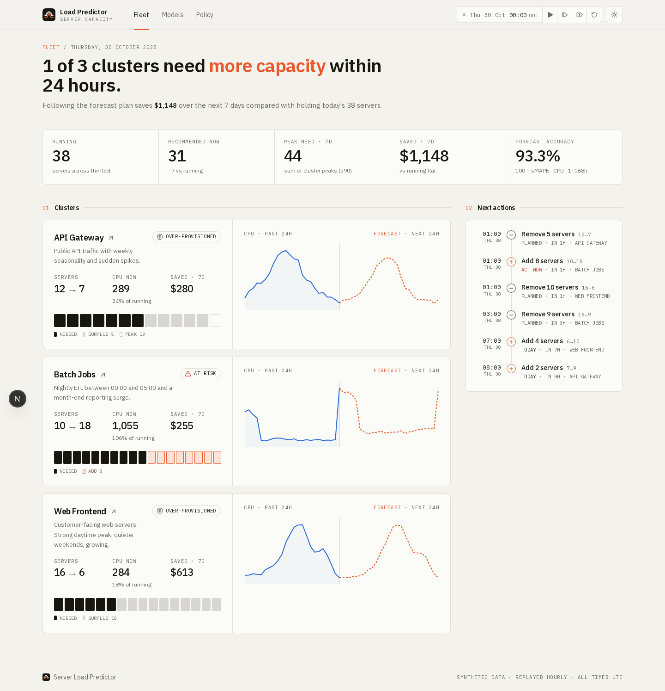
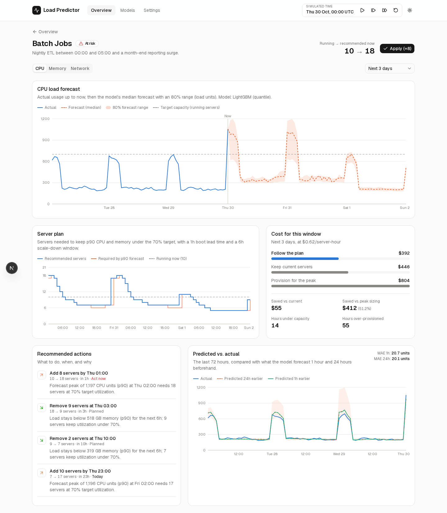

# Server Load Predictor

Predicts how much server capacity a data center will need **before** it needs it, and turns that
forecast into concrete scaling actions: *"Add 8 servers by Thu 01:00"*, *"Remove 9 servers at 03:00,
save $412 this week"*.

> Think of it as a weather forecast for computer usage. Instead of predicting rain and telling you
> to bring an umbrella, it predicts traffic and tells you to spin up (or shut down) servers.





## Why

Companies either keep too many servers running "just in case" (wasted money) or too few (slow sites
and outages). Reactive autoscaling only kicks in *after* load arrives, and new servers take time to
boot. Forecasting the load lets you scale ahead of time.

## What it does

1. **Collects usage history.** Hourly CPU, memory and network per cluster. It ships a realistic
   synthetic dataset (daily and weekly patterns, growth, traffic spikes, nightly batch jobs, a
   month-end surge and a Black Friday event), plus an optional loader for the Alibaba 2018 cluster
   trace.
2. **Finds patterns.** A LightGBM model learns them from lag, rolling-window, seasonal and calendar
   features.
3. **Predicts the future.** It forecasts every hour of the next 7 days with a median and an 80%
   range (p10–p90).
4. **Turns predictions into decisions.** It sizes each cluster so the p90 forecast stays under a
   target utilization. It allows for server boot time, avoids flapping, and prices the plan.
5. **Shows it visually.** A live dashboard with actual vs. predicted usage, the server plan,
   recommended actions and a model comparison. A **simulation clock** replays the held-out weeks one
   hour at a time, so you can watch forecasts meet reality.

## Architecture

```
┌──────────────── Next.js dashboard (frontend/, :3000) ─────────────────┐
│ Overview · Cluster detail · Models · Settings · simulation controls   │
│ TanStack Query refetches whenever the simulated "now" moves           │
└───────────────────────────────┬───────────────────────────────────────┘
                                │ REST / JSON
┌──────────────── FastAPI service (backend/, :8000) ────────────────────┐
│ api/          routers (clusters, forecast, recommendations, models,   │
│               simulation)                                             │
│ services.py   orchestration + forecast cache                          │
│ ml/           features · LightGBM quantile · baselines · backtest     │
│ recommender/  forecast → servers → actions → cost                     │
│ simulation/   clock that reveals "future" data hour by hour           │
└───────────────────────────────┬───────────────────────────────────────┘
                   SQLite (data/app.db) + trained models (artifacts/)
```

## Quick start

### Docker (one command)

```bash
docker compose up --build        # or: make up
```

Open http://localhost:3000. On the first start the API seeds the data and trains every model, which
takes about 2 minutes. The dashboard starts once the API is healthy. Data and models are kept in
Docker volumes.

### Local development

Requirements: [uv](https://docs.astral.sh/uv/), Node 20+ and pnpm.

```bash
make setup     # uv sync + pnpm install
make seed      # generate synthetic data  (optional: the API does this if the DB is empty)
make train     # train & backtest models, prints a comparison table (~2 min)
make dev       # API on :8000 and dashboard on :3000
```

Then press **▶ Play** in the header, or **+1h / +24h**, to advance simulated time.

| Command | What it does |
|---|---|
| `make api` / `make web` | run one side only |
| `make test` | backend pytest + frontend lint & type-check |
| `uv run python -m app.ml.train --until now` | retrain on data up to the current simulated time |
| API docs | http://localhost:8000/docs |

Set `NEXT_PUBLIC_API_URL` (see `frontend/.env.local.example`) if the API isn't on `localhost:8000`.
Backend settings use the `SLP_` prefix (see `backend/app/config.py`). For example,
`SLP_SIM_TICK_SECONDS=2` makes the clock faster.

## How the model works

**Direct multi-horizon forecasting.** Each training row is one *(origin time t, horizon h)* pair,
with h from 1 to 168 hours, and the target is the load at t + h. One model covers every horizon,
so errors don't compound the way recursive forecasts do.

**Features.** Every feature uses only data up to *t*. A unit test poisons all values after *t* and
checks that no feature changes.

- Lags: 0, 1, 2, 3, 6, 12, 24, 48 and 168 hours.
- Rolling 24h mean, std, min and max, plus week-over-week growth.
- Seasonal values: the latest known value at the same hour of the day and of the week, 1 and 2 weeks
  back, plus a 7-day same-hour average.
- Calendar features of the target time: hour, day of week, weekend flag, days to month end, and
  sin/cos encodings.

All values are divided by the trailing 7-day mean. That makes the model scale-free, so it copes with
growth that tree models can't extrapolate.

**Uncertainty.** Three LightGBM quantile regressors produce p10, p50 and p90. Quantile trees trained
on overlapping rows give intervals that are too narrow, so the band is widened with **split-conformal
calibration**. The model is fit without the last 2 weeks, the amount the actuals fall outside the
band there sets a per-horizon margin, and then the model is refit on all the data.

**Evaluation.** Each model gets a rolling-origin backtest over the last 21 days of training data:
a new origin every 24h, forecasting 1–168h ahead. Metrics are MAE, RMSE, sMAPE and 80%-interval
coverage. The lowest-MAE model becomes the production model for that cluster and metric.

Backtest on the synthetic data (CPU):

| Cluster | Seasonal naive MAE | Holt-Winters MAE | **LightGBM MAE** | LightGBM 80% coverage |
|---|---|---|---|---|
| API Gateway | 40.8 | 61.1 | **31.4** | 90% |
| Batch Jobs | 23.9 | 56.2 | **19.6** | 83% |
| Web Frontend | 33.9 | 62.6 | **28.6** | 81% |

LightGBM beats both baselines on all 9 series (3 clusters × CPU/memory/network).

## How recommendations are computed

`backend/app/recommender/engine.py` is pure functions and fully unit-tested:

1. **Required servers per hour** = `ceil(p90 load / (capacity per server × target utilization))`.
   This is computed for CPU and for memory; the larger one wins, clamped to the cluster's min/max.
   Sizing on **p90** builds in a safety margin.
2. **Lead time.** Servers take time to boot, so each hour's requirement is pulled forward by
   `lead_time_hours`.
3. **Hysteresis.** Scale up immediately. Scale down only when the need stays lower for
   `scale_down_window` hours.
4. **Actions.** Consecutive steps become actions with a plain-English reason and an urgency level
   (act now, within 6h, today, planned).
5. **Cost.** The plan is priced against keeping today's server count and against sizing for the
   week's peak. The engine also counts hours under capacity and hours over-provisioned.
6. **Status.** Each cluster gets one of: `healthy`, `scale_up_soon`, `over_provisioned` or `at_risk`.

You can change these parameters for each cluster on the **Settings** page. Recommendations update
immediately.

## Using the Alibaba cluster trace

1. Download `machine_usage.tar.gz` from
   [alibaba/clusterdata – cluster-trace-v2018](https://github.com/alibaba/clusterdata/tree/master/cluster-trace-v2018).
2. Extract it and put the file at `backend/data/raw/machine_usage.csv`.
3. `cd backend && uv run python -m app.data.seed --source alibaba`

Machines are hashed into three pseudo-clusters and resampled to hourly totals.
**Caveat:** the 2018 trace covers only 8 days. The weekly forecaster needs at least 2 weeks of
history (3+ weeks for a backtest), so the trace is useful for exploring real patterns. The
synthetic dataset is the one that drives the full demo.

## Project structure

```
backend/
  app/
    main.py              FastAPI app; startup seeds, trains and warms up
    config.py            settings (SLP_* env vars)
    models.py, db.py     SQLAlchemy tables: clusters, usage, forecasts, model_runs, meta
    schemas.py           API models (mirrored in frontend/src/lib/types.ts)
    services.py          forecasting service, cluster summaries, accuracy history
    api/                 routers
    data/                synthetic generator, Alibaba loader, seed CLI
    ml/                  features, LightGBM, baselines, backtest, registry, train CLI, retrain jobs
    recommender/         scaling engine
    simulation/          simulation clock
  tests/                 data, ML (incl. leakage test), recommender, API
frontend/
  src/app/               pages: overview, clusters/[id], models, settings
  src/components/        charts/, action list, status badge, simulation controls, …
  src/hooks/use-api.ts   TanStack Query hooks keyed on simulated time
  src/lib/               API client, types, formatting
```

## Future work

- Push recommendations to a real autoscaler (Kubernetes HPA/KEDA, AWS Auto Scaling scheduled actions).
- Ingest live metrics from Prometheus instead of the replayed dataset.
- Anomaly detection: flag hours where actuals leave the forecast band.
- Holiday and event calendars as features. The model currently can't anticipate a Black Friday it
  has never seen, which you can watch happen at the end of the simulation.
- A global model across many clusters, and probabilistic cost optimization (spot vs. on-demand).

## License

[MIT](LICENSE)
